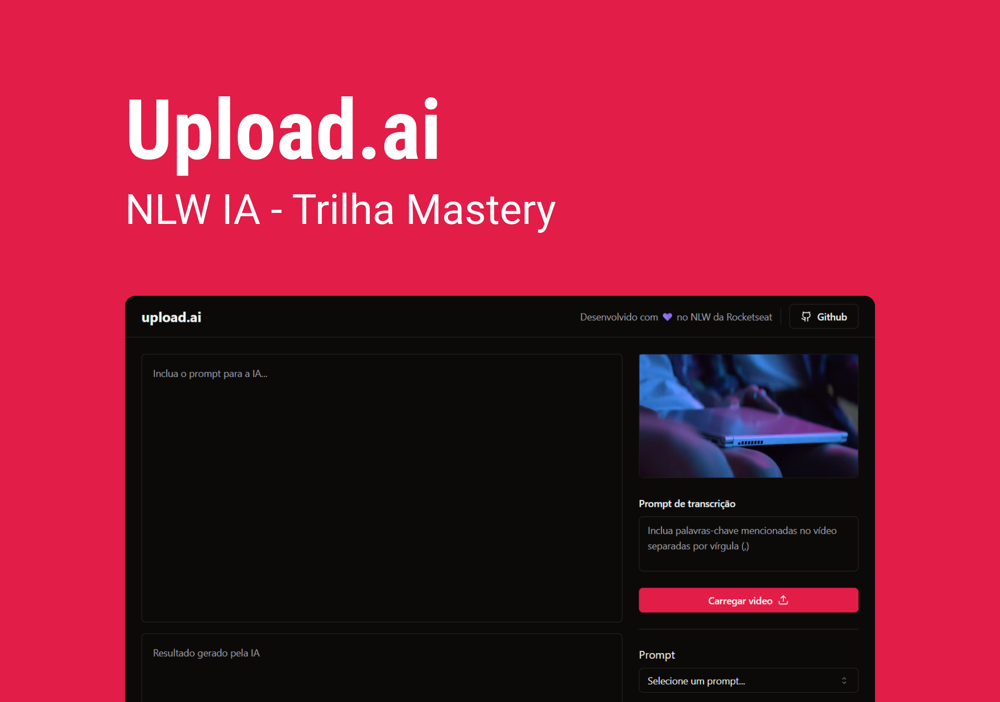
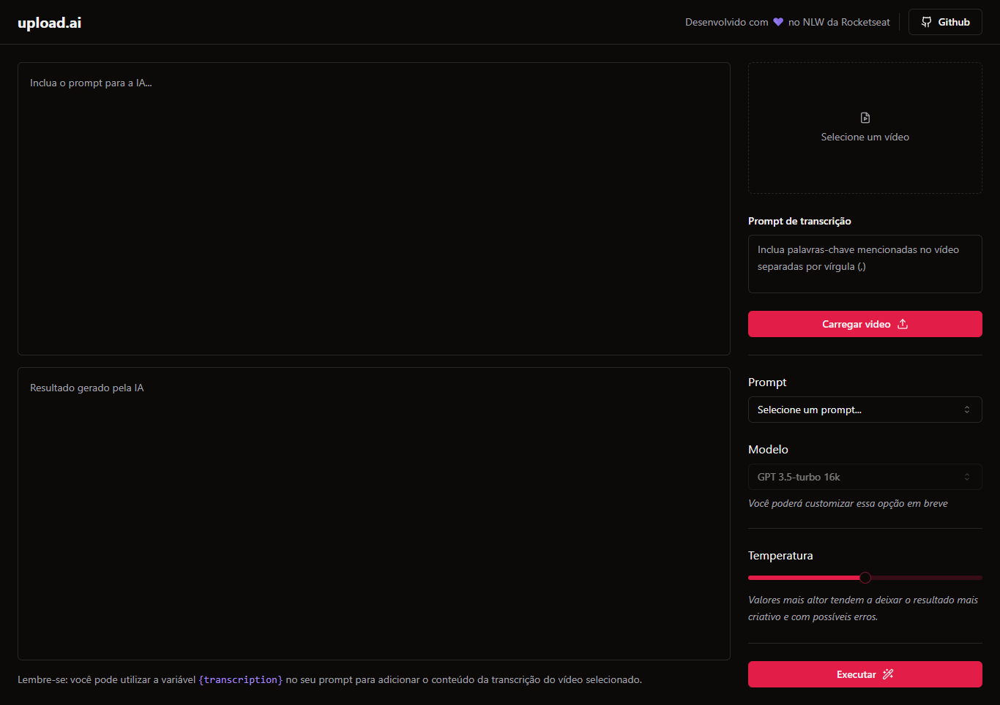
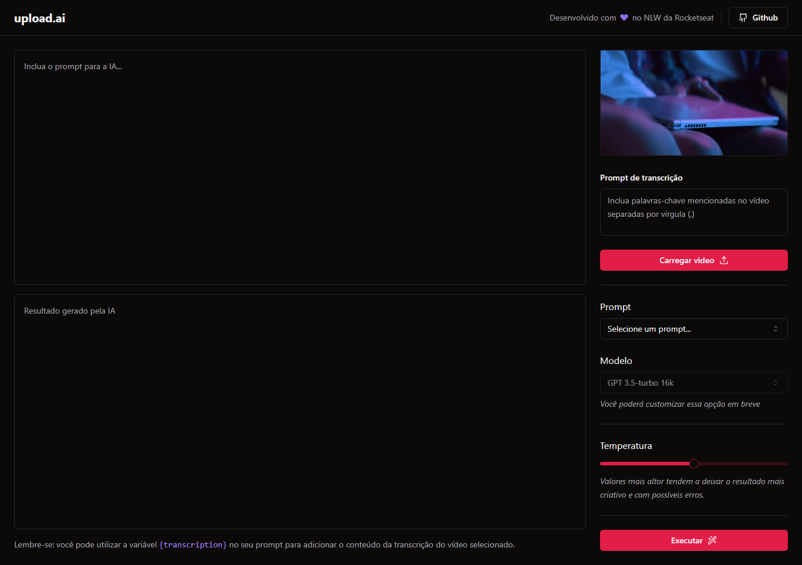
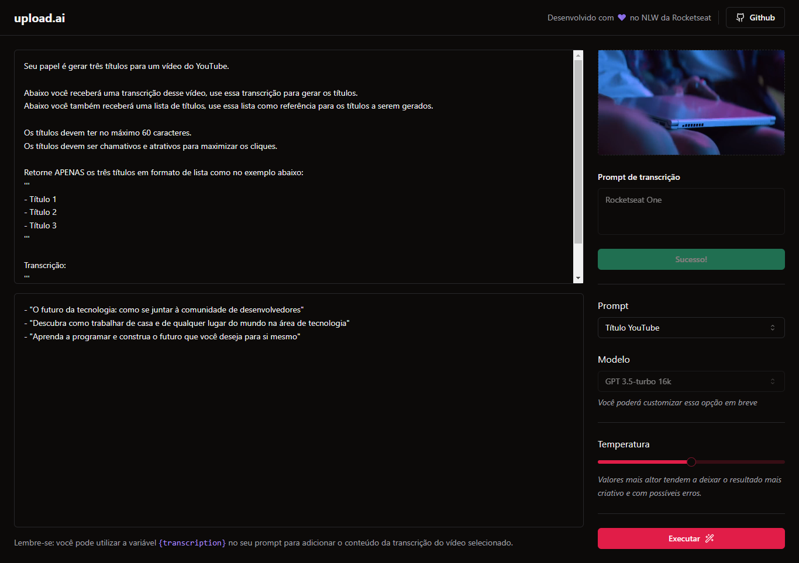
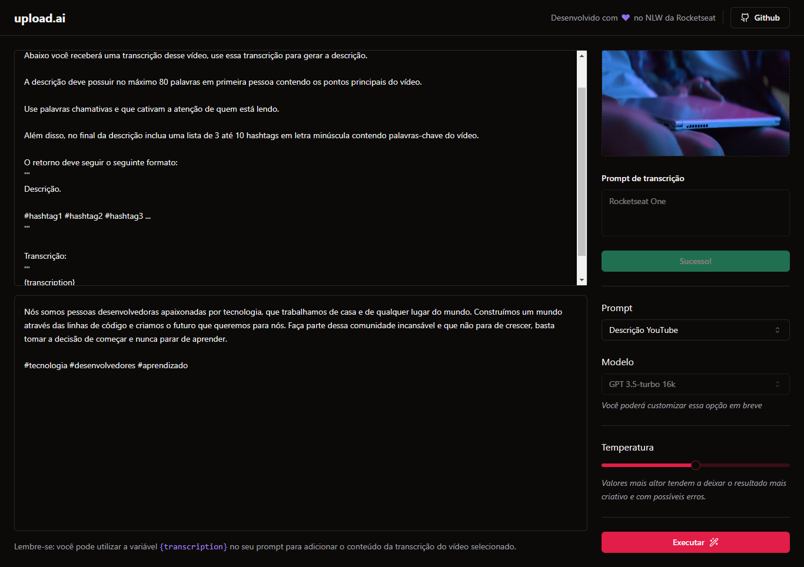

<h1 align="center">
  
  Upload.ai
</h1>

<p align="center">
  

  
  
  <a href="https://github.com/pabloxt14/nlw-ai/commits/main">
    
  </a>
    
   

   <a href="https://github.com/pabloxt14/nlw-ai/stargazers">
    
  </a>
</p>

<p>
  
</p>

<h4 align="center"> 
	🚀 Aplicação finalizada 🚀
</h4>

<p align="center">
 <a href="#-about">About</a> |
 <!-- <a href="#-deploy">Deploy</a> | -->
 <a href="#-layout">Layout</a> | 
 <a href="#-how-it-works">How It Works</a> | 
 <a href="#-technologies">Technologies</a> | 
 <a href="#-author">Author</a> | 
 <a href="#-license">License</a>
</p>


## 💻 About

O `Upload.ai` é uma aplicação que possibilita realizar upload de videos e por meio de IA, criar automaticamente títulos chamativos e descrições com um boa indexação.

O projeto foi desenvolvido durante o evento **NLW - Next Level Week** oferecida pela [Rocketseat](https://www.rocketseat.com.br/). O NLW é uma experiência online com muito conteúdo prático, desafios e hacks onde o conteúdo fica disponível durante uma semana.

---

## 🎨 Layout

Veja uma demonstração visual das principais telas da aplicação a seguir.

<p align="center">
  
</p>

<p align="center">
  
</p>

<p align="center">
  
</p>

<p align="center">
  
</p>

---

## 🚀 How it works

Este projeto é divido em 2 partes:
1. Back-end (pasta server) 
2. Front-end (pasta web)

💡 O Front-end precisam que o Back-end esteja sendo executado para funcionar.

### Pré-requisitos

Antes de baixar o projeto você vai precisar ter instalado na sua máquina as seguintes ferramentas:

* [Git](https://git-scm.com)
* [NodeJS](https://nodejs.org/en/)
* [Yarn](https://yarnpkg.com/) ou [NPM](https://www.npmjs.com/)
* Para o banco de dados ter o [PostgreSQL](https://www.postgresql.org/) ou [Docker](https://www.docker.com/) para baixar a imagem do banco.

Além disto é bom ter um editor para trabalhar com o código como [VSCode](https://code.visualstudio.com/)

#### 🎲 Rodando o Backend (servidor)

```bash
# Clone este repositório
$ git clone git@github.com:pabloxt14/nlw-ai.git

# Acesse a pasta do projeto no terminal/cmd
$ cd nlw-ai

# Vá para a pasta server
$ cd server

# Instale as dependências
$ npm install

# Crie uma arquivo .env e preencha conforme apresentado no arquivo .env.example

# Executar seu banco de dados

# Executar o seguinte comando para criar as migrations no banco
$ npx prisma migrate dev

# Execute a aplicação em modo de desenvolvimento
$ npm run dev

# O servidor inciará na porta:3333 - acesse http://localhost:3333 
```

#### 🧭 Rodando a aplicação web (Frontend)

```bash
# Vá para a pasta da aplicação Front End
$ cd web

# Instale as dependências
$ npm install

# Execute a aplicação em modo de desenvolvimento
$ npm run dev

# A aplicação inciará em alguma porta disponível que poderá ser acessada pelo navegador
```

---

## 🛠 Technologies

As seguintes ferramentas foram usadas na construção do projeto:

#### **Server**  ([NodeJS](https://nodejs.org/en/)  +  [TypeScript](https://www.typescriptlang.org/))

-   **[Fastify](https://www.fastify.io/)**
-   **[Zod](https://github.com/colinhacks/zod)**
-   **[Prisma](https://www.prisma.io/)**
-   **[PostgreSQL](https://www.postgresql.org/)**
-   **[OpenAI](https://github.com/openai/openai-node)**
-   **[Vercel AI SDK](https://github.com/vercel/ai)**

> 📘 **Info**
>
> Para mais detalhes das dependências gerais do front-end veja o arquivo [package.json](https://github.com/PabloXT14/nlw-ai/blob/main/server/package.json)

#### **Website**  ([Vite](https://vitejs.dev/)  +  [TypeScript](https://www.typescriptlang.org/))

-   **[Shadcn/UI](https://ui.shadcn.com/)**
-   **[TailwindCSS](https://tailwindcss.com/)**
-   **[RadixUI](https://www.radix-ui.com/)**
-   **[Lucide React](https://lucide.dev/)**
-   **[FFMpeg](https://ffmpegwasm.netlify.app/docs/overview)**
-   **[Axios](https://github.com/axios/axios)**
-   **[Vercel AI SDK](https://github.com/vercel/ai)**

> 📘 **Info**
>
> Para mais detalhes das dependências gerais do back-end veja o arquivo [package.json](https://github.com/PabloXT14/nlw-ai/blob/main/web/package.json)

---

## ✍ Author


[](https://www.linkedin.com/in/pabloalan/)

[](mailto:pabloxt14@gmail.com)

---

## 📝 License

Este projeto está sob a licença MIT. Consulte o arquivo [LICENSE](./LICENSE) para mais informações

Feito com 💜 por Pablo Alan 👋🏽 [Entre em contato!](https://www.linkedin.com/in/pabloalan/)
